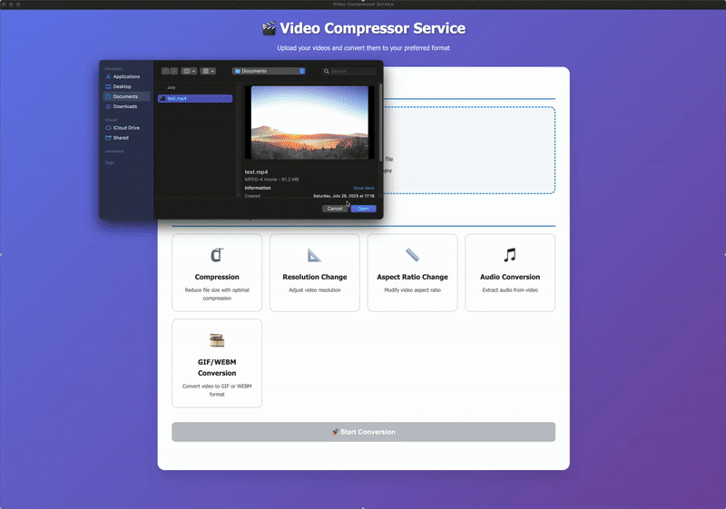

# Video Compressor Service
A secure client-server video processing application with encryption capabilities, built with Electron (TypeScript) frontend and Python backend.



## Features
### Video Processing Operations
- **Video Compression**: Optimize file size with dynamic quality settings
- **Resolution Change**: Support for 480p, 720p, 1080p, 1440p, and 4K
- **Aspect Ratio Adjustment**: Convert between 16:9 and 4:3 formats
- **Audio Extraction**: Convert videos to MP3 audio files
- **GIF/WEBM Conversion**: Create animated clips from video segments

### Security Features
- **RSA Encryption**: 2048-bit RSA key exchange for secure communication
- **AES-256-GCM Encryption**: End-to-end encryption for all file transfers
- **Secure Key Storage**: Client-side secure key management using Electron's safeStorage

### Technical Architecture
- **Client**: Electron desktop application with TypeScript
- **Server**: Python-based processing server with FFmpeg integration
- **Communication**: Encrypted TCP socket connection
- **File Processing**: Chunked streaming with configurable rates

## Project Structure
```
videoCompressor/
├── client_desktop_app/         # Electron frontend
│   ├── src/
│   │   ├── main.ts             # Electron main process
│   │   ├── preload.ts          # IPC bridge
│   │   ├── renderer.ts         # UI logic
│   │   ├── index.html          # Main interface
│   │   └── style.css           # Styling
│   ├── dist/                   # Compiled TypeScript
│   ├── package.json
│   └── tsconfig.json
├── server/
│   ├── server.py               # Python processing server
│   ├── __init__.py
|   └──  storage/               # Temporary file storage
├── config.json                 # Configuration file
└── README.md
```

## Quick Start
### Prerequisites
#### For Client (Electron App)
- **Node.js** (v16 or higher)
- **npm** (comes with Node.js)
- **Git**

#### For Server (Python)
- **Python** 3.11.2
- **Poetry** (dependency management)
- **FFmpeg** (video processing engine)

### Installation
#### 1. Clone Repository
```bash
git clone <repository-url>
cd videoCompressor
```

#### 2. Server Setup
```bash
# Install Python dependencies
poetry install

# Start the server
poetry run python server/server.py
```

#### 3. Client Setup
```bash
# Navigate to client directory
cd client_desktop_app

# Install dependencies
npm install

# Build TypeScript
npm run build

# Start application
npm start
```

### Configuration
Edit `config.json` to customize server settings:
```json
{
  "server_address": "127.0.0.1",
  "server_port": 65432,
  "max_storage": 1073741824,
  "storage_dir": "/storage",
  "stream_rate": 4096
}
```

## Development
### Client Development Commands
```bash
npm start      # Build and run application
npm run build  # Compile TypeScript
```

### Adding Dependencies
```bash
# Python (server)
poetry add <package-name>

# Node.js (client)
cd client_desktop_app
npm install <package-name>
```

## Security Implementation
### Encryption Flow
1. **Key Generation**: Client generates RSA key pair on startup
2. **Public Key Exchange**: Client and server exchange RSA public keys
3. **AES Key Distribution**: Client generates AES-256 key, encrypts with server's RSA public key
4. **Secure Communication**: All file data encrypted with AES-256-GCM

### Security Features in Code
**TypeScript (Client):**
```typescript
// RSA key generation
const { publicKey, privateKey } = generateKeyPairSync("rsa", {
  modulusLength: 2048,
  publicKeyEncoding: { type: "spki", format: "pem" },
  privateKeyEncoding: { type: "pkcs8", format: "pem" }
});

// AES encryption
function encryptChunk(chunk: Buffer, key: Buffer): Buffer {
  const nonce = randomBytes(12);
  const cipher = createCipheriv('aes-256-gcm', key, nonce);
  // ... encryption logic
}
```

**Python (Server):**
```python
# RSA key management
class RSAManager:
    def __init__(self):
        self.private_key = rsa.generate_private_key(
            public_exponent=65537,
            key_size=2048
        )
```

## Video Processing Features
### Supported Operations
- **Compression**: Dynamic quality based on file size
- **Resolution**: 480p to 4K support
- **Format Conversion**: MP4, MP3, GIF, WEBM
- **Aspect Ratio**: 16:9, 4:3 conversion
- **Time-based Clipping**: Custom start/end times

### FFmpeg Integration
The server uses FFmpeg for all video processing operations with optimized commands for each operation type.

## Development Context
This project was developed over 2 weeks by a 3-person team. It demonstrates:

- **Full-stack development** with TypeScript and Python
- **Cryptographic security** implementation
- **Desktop application** development with Electron
- **Video processing** with FFmpeg
- **Asynchronous communication** patterns
- **Error handling** and user experience design

## Technology Stack
### Frontend
- **Electron**: Desktop application framework
- **TypeScript**: Type-safe JavaScript
- **HTML/CSS**: Modern UI design
- **Node.js**: Runtime environment

### Backend
- **Python 3.11.2**: Server implementation
- **Poetry**: Dependency management
- **FFmpeg**: Video processing
- **Cryptography**: Security implementation

### Communication
- **TCP Sockets**: Client-server communication
- **RSA + AES**: Hybrid encryption
- **Chunked Streaming**: Efficient file transfer

## Usage
1. **Launch Application**: Start both server and client
2. **Upload Video**: Click upload area to select MP4 file
3. **Choose Operation**: Select compression, resolution change, etc.
4. **Configure Settings**: Adjust parameters for selected operation
5. **Process**: Click execute to start processing
6. **Download**: Save processed file to desired location
